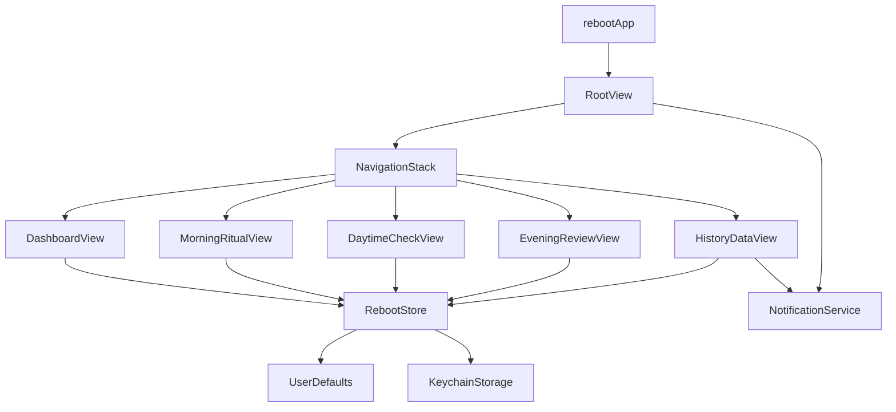

# Reboot iOS

一个基于 SwiftUI 的轻量自我管理应用，围绕“早晨仪式 -> 白天中断 -> 晚间复盘 -> 历史回看”形成日闭环。项目当前采用纯本地架构，不依赖后端，数据保存在设备侧。

## 项目目标

- 用尽量短的交互路径，帮助用户完成当天的重启闭环。
- 用本地通知把用户从“自动驾驶”里拉回来。
- 用低复杂度架构保持页面迭代和功能扩展的速度。

## 技术栈

- `SwiftUI`：页面搭建、导航、状态驱动渲染。
- `Combine` + `ObservableObject`：全局状态管理。
- `UserDefaults`：主存储。
- `Keychain`：状态冗余备份，降低数据丢失风险。
- `UserNotifications`：本地提醒调度。
- `Foundation` / `Security`：日期处理、序列化、系统安全存储。

## 架构概览

项目是一个典型的单端、本地优先、轻量 MVVM 风格架构。这里没有严格拆出 ViewModel，而是把业务状态和应用级逻辑集中在 `RebootStore` 中，由 SwiftUI 页面直接消费。



## 分层说明

### 1. App 层

- 文件：`reboot/reboot/rebootApp.swift`
- 责任：创建全局 `RebootStore`，通过 `environmentObject` 注入整个应用。

### 2. 路由与启动层

- 文件：`reboot/reboot/Views/RootView.swift`
- 责任：
  - 控制启动页和主内容切换。
  - 维护 `NavigationStack` 路径。
  - 在启动阶段同步通知权限与提醒任务。

### 3. 视图层

- 目录：`reboot/reboot/Views/`
- 责任：
  - 承载交互和展示。
  - 直接读取 `RebootStore` 中的状态。
  - 在用户动作发生时调用 Store 的保存接口。

核心页面：

- `DashboardView`：今日总览和主入口。
- `MorningRitualView`：三步式晨间记录。
- `DaytimeCheckView`：三次白天检查与反思录入。
- `EveningReviewView`：晚间能量评分和明日唯一要事。
- `HistoryDataView`：历史统计、提醒开关、JSON 导出。
- `LoadingView`：启动过渡页。

### 4. 状态与业务层

- 文件：`reboot/reboot/Store/RebootStore.swift`
- 责任：
  - 管理用户名称、通知开关、每日记录等全局状态。
  - 计算通关状态、日进度、连续 streak、历史摘要。
  - 负责持久化和恢复状态。

这是当前项目的核心业务中心，承担了：

- 状态容器
- 领域计算
- 数据持久化入口

### 5. 模型层

- 文件：`reboot/reboot/Models/RebootModels.swift`
- 责任：
  - 定义路由枚举、业务枚举、记录结构体、持久化结构体。
  - 保持模型 `Codable`，方便本地 JSON 编解码。

主要模型：

- `DailyRecord`：单天完整记录。
- `MorningRecord`：早晨仪式数据。
- `DaytimeRecord` / `DaytimeReflection`：白天检查及反思数据。
- `EveningRecord`：晚间复盘数据。
- `PersistedState`：应用持久化快照。

### 6. 服务层

- 目录：`reboot/reboot/Services/`
- 责任：封装系统能力，避免页面和 Store 直接接触底层 API。

当前服务：

- `NotificationService`
  - 请求通知权限
  - 查询权限状态
  - 调度每天固定时点提醒
  - 清空待触发通知
- `KeychainStorage`
  - 把整份状态快照作为二进制数据存入 Keychain
  - 在 `UserDefaults` 缺失时作为兜底恢复来源

### 7. 工具与主题层

- 目录：`reboot/reboot/Utils/`

当前工具：

- `DateHelpers`
  - 统一日期 key 格式
  - 统一展示格式
- `RebootTheme`
  - 统一颜色、卡片样式、输入框样式、点击区域样式
  - 负责深浅色动态主题适配

## 数据流

应用数据流是单向的：

1. 视图从 `RebootStore` 读取状态。
2. 用户在页面中输入或点击。
3. 视图调用 `RebootStore` 的保存方法。
4. `RebootStore` 更新内存中的 `@Published` 状态。
5. SwiftUI 自动刷新依赖该状态的页面。
6. Store 将最新状态编码后写入 `UserDefaults`，并同步备份到 `Keychain`。

这套设计的优点是：

- 数据路径短，易追踪。
- 对单机应用足够稳定。
- 维护成本低，适合快速试验产品节奏。

## 核心业务规则

- “通关”判定：`早晨完成 && 白天至少完成 2 次检查`
- 今日进度：拆成 4 个单位
  - 早晨完成
  - 白天完成 1 次
  - 白天完成 2 次
  - 晚间完成
- 历史统计：
  - 支持按日期范围筛选
  - 计算总天数、通关天数、平均能量、连续 streak

说明：晚间复盘会影响能量曲线和明日目标，但不直接参与“通关”判断。

## 持久化策略

当前方案是“双写”：

- 主写入：`UserDefaults`
- 备份写入：`Keychain`

恢复顺序：

1. 优先从 `UserDefaults` 读取。
2. 如果失败，再从 `Keychain` 读取。
3. 如果 `UserDefaults` 成功恢复，会顺带刷新一份到 `Keychain`。
4. 如果 `Keychain` 成功恢复，会反向回填到 `UserDefaults`。

这个策略的目的不是高安全级别加密，而是做一层轻量冗余，尽量减少本地状态意外丢失。

## 通知机制

应用当前内置了 5 个固定提醒点：

- `06:00` 早晨仪式
- `11:00` 白天检查 1
- `14:00` 白天检查 2
- `17:00` 白天检查 3
- `21:00` 晚间复盘

通知流程：

1. 启动时由 `RootView` 同步通知状态。
2. 若本地设置显示提醒关闭，则直接清空待调度任务。
3. 若提醒开启，则检查系统权限。
4. 获得授权后，重新注册每天重复提醒。
5. `HistoryDataView` 中允许用户直接开关提醒。

## 目录结构

```text
reboot_ios/
├── README.MD
└── reboot/
    ├── reboot.xcodeproj
    └── reboot/
        ├── Assets.xcassets
        ├── Models
        │   └── RebootModels.swift
        ├── Services
        │   ├── KeychainStorage.swift
        │   └── NotificationService.swift
        ├── Store
        │   └── RebootStore.swift
        ├── Utils
        │   ├── DateHelpers.swift
        │   └── RebootTheme.swift
        ├── Views
        │   ├── DashboardView.swift
        │   ├── DaytimeCheckView.swift
        │   ├── EveningReviewView.swift
        │   ├── HistoryDataView.swift
        │   ├── LoadingView.swift
        │   ├── MorningRitualView.swift
        │   └── RootView.swift
        └── rebootApp.swift
```

## 适合当前阶段的原因

这个项目当前规模很小，采用“单 Store + 本地持久化 + SwiftUI 页面直连”的方式是合理的，因为：

- 页面数量少，业务链路清晰。
- 没有多人协作下复杂的领域边界问题。
- 目前没有远程同步、账号体系、复杂离线冲突问题。
- 过早引入 Repository、UseCase、DI 容器会增加样板代码。

## 后续可演进方向

如果项目继续扩展，建议按下面的顺序演进：

### 1. 拆分 Store

把 `RebootStore` 拆成更明确的职责模块，例如：

- `SessionStore`
- `DailyRecordStore`
- `HistoryStore`
- `NotificationSettingsStore`

### 2. 引入 Repository 层

当持久化方式变复杂时，把读写逻辑从 Store 中抽离：

- `LocalStateRepository`
- `NotificationRepository`

### 3. 持久化升级

如果后续需要查询能力、统计效率或多端同步准备，可以考虑：

- `SwiftData`
- `Core Data`
- 本地数据库 + 云同步

### 4. 加强测试

建议优先补下面几类测试：

- `RebootStore` 的业务规则测试
- streak 与历史摘要计算测试
- 持久化编码/解码测试
- 通知开关行为测试

## 构建与运行

1. 使用 Xcode 打开 `reboot/reboot.xcodeproj`
2. 选择 scheme `reboot`
3. 运行到 iPhone 模拟器或真机

说明：项目当前是纯本地应用，不依赖后端服务或环境变量。

